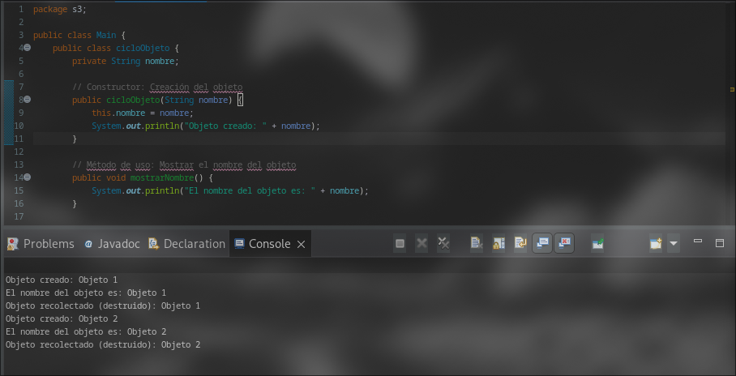
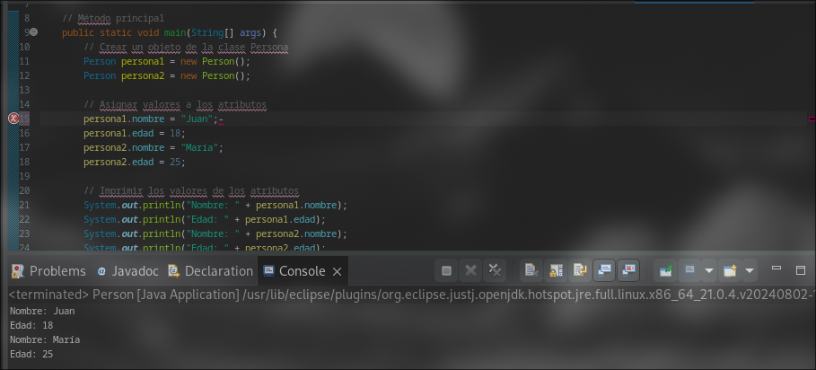
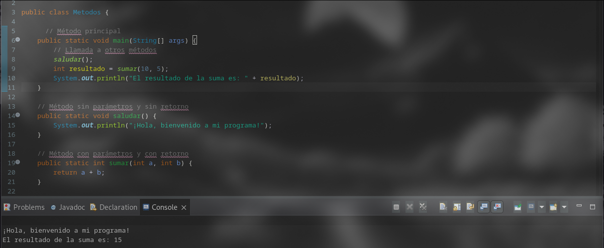
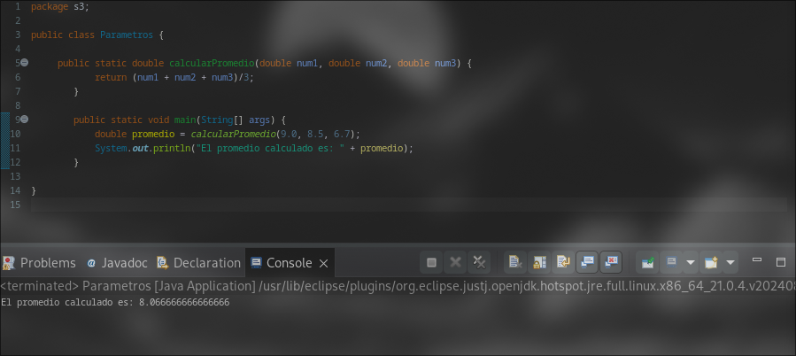
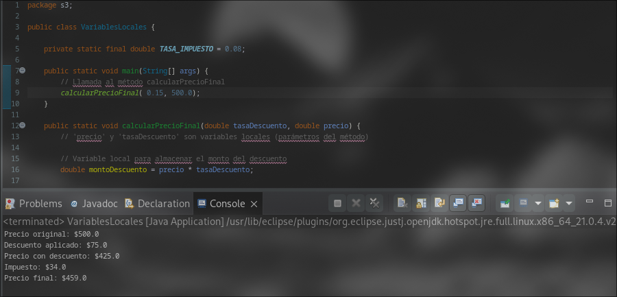
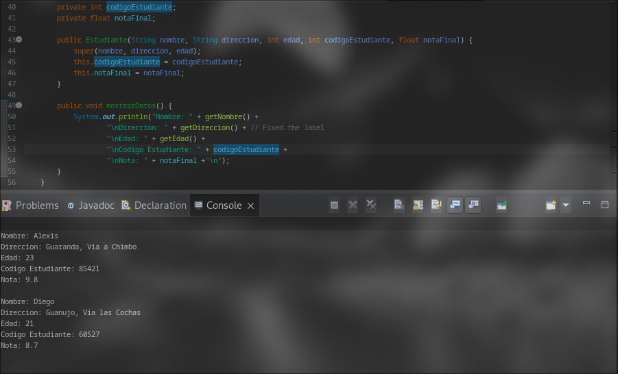

# Ejercicios de Java en exposiciones

**Estudiante:** Ariel Alejandro Calderon \
**Asignatura:** POO \
**Fecha:** 20/09/2024

1) **Tema**: Objetos
- **Ejercicio**: Realizar un ejemplo hacer del ciclo de vida de un objeto en Java.
- **Codigo**:
```java
package ejerciciodeexposicion;

public class Main {

    public class cicloObjeto {
    private String nombre;

    // Constructor: Creación del objeto
    public cicloObjeto(String nombre) {
        this.nombre = nombre;
        System.out.println("Objeto creado: " + nombre);
    }

    // Método de uso: Mostrar el nombre del objeto
    public void mostrarNombre() {
        System.out.println("El nombre del objeto es: " + nombre);
    }

    // Método finalize: Demuestra la finalización (destrucción) del objeto
    @Override
    protected void finalize() throws Throwable {
        System.out.println("Objeto recolectado (destruido): " + nombre);
        super.finalize();
    }
}
    public static void main(String[] args) {
        // Creación de un objeto de la clase CicloObjeto
        cicloObjeto objeto1 = new cicloObjeto("Objeto 1");

        // Uso del objeto: Llamar a un método del objeto
        objeto1.mostrarNombre();  // Imprime: El nombre del objeto es: Objeto 1

        // Finalización del objeto: Eliminar la referencia
        objeto1 = null;  // El objeto ya no tiene referencia y está listo para la recolección

        // Sugerir al Garbage Collector que recolecte los objetos sin referencia
        System.gc();  // Sugerencia para activar la recolección de basura

        // Pausa para permitir la acción del Garbage Collector (solo para observación)
        try {
            Thread.sleep(1000);  // Pausa de 1 segundo
        } catch (InterruptedException e) {
            e.printStackTrace();
        }

        // Crear otro objeto para mostrar otro ciclo de vida
        cicloObjeto objeto2 = new cicloObjeto("Objeto 2");
        objeto2.mostrarNombre();
        objeto2 = null;  // Dejar el objeto sin referencia
        System.gc();  // Sugerir recolección de basura nuevamente
    }

}
```


2) **Tema**: Atributos 
- **Ejercicio**: Crear una clase *Persona* con atributos nombre y edad. Instanciar la clase en dos objetos e imprimir los atributos de la clase.
- **Codigo**:
```java
public class Persona {

        
    String nombre;
    int edad;
    
    // Método principal
    public static void main(String[] args) {
        // Crear un objeto de la clase Persona
        Persona persona1 = new Persona();
        Persona persona2 = new Persona();
       
        // Asignar valores a los atributos
        persona1.nombre = "Juan";
        persona1.edad = 18;
        persona2.nombre = "María";
        persona2.edad = 25;
      
        // Imprimir los valores de los atributos
        System.out.println("Nombre: " + persona1.nombre);
        System.out.println("Edad: " + persona1.edad);
        System.out.println("Nombre: " + persona2.nombre);
        System.out.println("Edad: " + persona2.edad);
 
 
    }

}
```


3) **Tema**: Metodos en Java y metodo *main*.
- **Ejercicio**: Implementar dentro de la clase principal un metodo que sume dos enteros y retorne el resultado y otro metodo imprima un mensaje (sin retornar nada). Llamar ambos métodos dentro del metodo main.
- **Codigo:**

```java
public class Metodos {

	  // Método principal
    public static void main(String[] args) {
        // Llamada a otros métodos
        saludar();
        int resultado = sumar(10, 5);
        System.out.println("El resultado de la suma es: " + resultado);
    }

    // Método sin parámetros y sin retorno
    public static void saludar() {
        System.out.println("¡Hola, bienvenido a mi programa!");
    }

    // Método con parámetros y con retorno
    public static int sumar(int a, int b) {
        return a + b;
    }

}
```



4) **Tema**: Parametros y argumentos
- **Ejercicio**: Demuestra cómo un método puede recibir varios parámetros y argumentos. El método "calcularPromedio" calcula el promedio de tres números, recibiendo tres parámetros del tipo double.
- **Codigo:**

```java
public class Parametros {


    public static double calcularPromedio(double num1, double num2, double num3) {
        return (num1 + num2 + num3)/3;
    }

    public static void main(String[] args) {
        double promedio = calcularPromedio(9.0, 8.5, 6.7);
        System.out.println("El promedio calculado es: " + promedio);
    }
}
```



5) **Tema**: Variables Locales
- **Ejercicio**: Implementar un metodo que reciba tasa de descuento y precio e imprima en pantalla la siguiente informacion: monto de descuento, precio con descuento, monto de impuesto y precio final.
- **Codigo:**

```java
public class VariablesLocales {
    // Variable de instancia (no es local)
    //Definición: Se declaran dentro de una clase pero fuera de cualquier método.
    //Alcance: Son accesibles desde cualquier método de la clase en la que se definen.
    private static final double TASA_IMPUESTO = 0.08;

    public static void main(String[] args) {             
        // Llamada al método calcularPrecioFinal
        calcularPrecioFinal( 0.15, 500.0);
    }   

    public static void calcularPrecioFinal(double tasaDescuento, double precio) {
        // 'precio' y 'tasaDescuento' son variables locales (parámetros del método)
        
        // Variable local para almacenar el monto del descuento
        double montoDescuento = precio * tasaDescuento;
        
        // Variable local para el precio después del descuento
        double precioConDescuento = precio - montoDescuento;
        
        // Variable local para el monto del impuesto
        double montoImpuesto = precioConDescuento * TASA_IMPUESTO;
        
        // Variable local para el precio final
        double precioFinal = precioConDescuento + montoImpuesto;
        
        // Usamos las variables locales para imprimir el resultado
        System.out.println("Precio original: $" + precio);
        System.out.println("Descuento aplicado: $" + montoDescuento);
        System.out.println("Precio con descuento: $" + precioConDescuento);
        System.out.println("Impuesto: $" + montoImpuesto);
        System.out.println("Precio final: $" + precioFinal );
        
        // Todas las variables locales dejan de existir aquí, al final del método
    }
        
}
```



6) **Tema**: Herencia
- **Ejercicio**: Implementa un programa en Java que utilice herencia, donde debes crear una clase llamada Persona que contenga los atributos nombre, apellido y edad, y luego crea una clase que herede de Persona.
- **Codigo:**

```java
public class Herencia {
    public static void main(String[] args) {
        Estudiante estudiante1 = new Estudiante("Alexis", "Guaranda, Via a Chimbo", 23, 85421, 9.8f);
        estudiante1.mostrarDatos();
        
        // You can create another Estudiante object here if needed
        Estudiante estudiante2 = new Estudiante("Diego", "Guanujo, Via las Cochas", 21, 60527, 8.7f);
        estudiante2.mostrarDatos();
    }
}

class Persona {
    private String nombre;
    private String direccion;
    private int edad;

    public Persona(String nombre, String direccion, int edad) {
        this.nombre = nombre;
        this.direccion = direccion;
        this.edad = edad;
    }

    public String getNombre() {
        return nombre;
    }

    public String getDireccion() {
        return direccion;
    }

    public int getEdad() {
        return edad;
    }
}

class Estudiante extends Persona {
    private int codigoEstudiante;
    private float notaFinal;

    public Estudiante(String nombre, String direccion, int edad, int codigoEstudiante, float notaFinal) {
        super(nombre, direccion, edad);
        this.codigoEstudiante = codigoEstudiante;
        this.notaFinal = notaFinal;
    }

    public void mostrarDatos() {
        System.out.println("Nombre: " + getNombre() +
                "\nDireccion: " + getDireccion() + // Fixed the label
                "\nEdad: " + getEdad() +
                "\nCodigo Estudiante: " + codigoEstudiante +
                "\nNota: " + notaFinal +"\n");
    }
}
```

