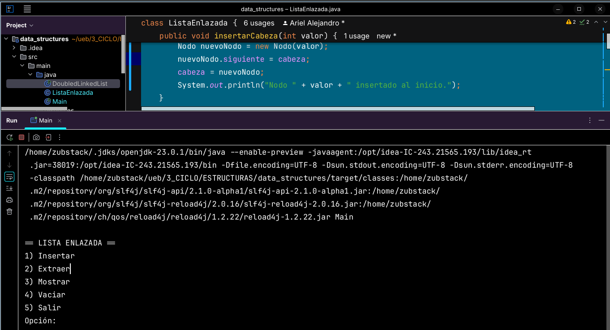

## Programa de Listas (ACD) - ESTRUCTURAS DE DATOS

**Fecha**: 20/03/2025

**Integrantes**:
- Ariel Alejandro Calderon
- Angeles Xiomara Punina 
- Mikaela Alejandra Paredes

**Ejercicio:** Implementar un menu de opciones para la clase de Java *Lista Enlazada* que incluya los siguientes métodos:

- Ingreso en cabecera
- Ingreso al final
- Ingreso al final recursivo
- Ingreso por valor
- Ingreso por referencia
- Extracción en cabecera
- Extracción al final
- Extracción por valor
- Extracción por referencia 
- Recorrido
- Recorrido recursivo
- Recorrido recursivo inverso

**Clase Main:**
```java
import java.util.Scanner;

public class Main {
    static Scanner scan = new Scanner(System.in);
    static ListaEnlazada lista = new ListaEnlazada();

    public static void main(String[] args) {
        int opcionPrincipal = 0;

        // Opciones de los menús
        String[] opciones = {"Insertar", "Extraer", "Mostrar", "Vaciar", "Recorrer", "Salir"};
        String[] opcionesSecundarias = {"Cabeza", "Cola", "Valor", "Referencia", "Regresar"};
        String[] opcionesRecorrido = {"Recorrido normal", "Recorrido inverso", "Regresar"};

        while (opcionPrincipal != opciones.length) { // Mientras no se elija "Salir"
            System.out.println("\n== LISTA ENLAZADA ==");
            mostrarOpciones(opciones);
            opcionPrincipal = leerOpcion(1, opciones.length);

            switch (opcionPrincipal) {
                case 1: // Insertar
                    ejecutarMenu(opcionesSecundarias, true);
                    break;
                case 2: // Extraer
                    ejecutarMenu(opcionesSecundarias, false);
                    break;
                case 3: // Mostrar lista
                    lista.mostrar();
                    break;
                case 4: // Vaciar lista
                    lista.limpiar();
                    System.out.println("La lista enlazada ha sido vaciada.");
                    break;
                case 5: // Recorrer
                    ejecutarRecorrido(opcionesRecorrido);
                    break;
                case 6: // Salir
                    System.out.println("Saliendo del programa...");
                    break;
            }
        }

        scan.close();
    }

    // Método para mostrar el menú de opciones
    static void mostrarOpciones(String[] opciones) {
        for (int i = 0; i < opciones.length; i++) {
            System.out.println((i + 1) + ") " + opciones[i]);
        }
    }

    // Método para manejar los submenús de inserción y extracción
    static void ejecutarMenu(String[] opciones, boolean esInsercion) {
        System.out.println("\nSeleccione una opción:");
        mostrarOpciones(opciones);
        int opcion = leerOpcion(1, opciones.length);

        if (opcion == opciones.length) return; // Si elige "Regresar", salir del submenú

        if (esInsercion) {
            ejecutarInsercion(opcion);
        } else {
            ejecutarExtraccion(opcion);
        }
    }

    // Método para manejar la inserción de nodos
    static void ejecutarInsercion(int opcion) {
        int valor = leerEntero("Ingrese el valor del nodo: ");

        switch (opcion) {
            case 1:
                lista.insertarCabeza(valor);
                break;
            case 2:
                lista.insertarCola(valor);
                break;
            case 3:
                int valorDespues = leerEntero("Ingrese el valor del nodo después del cual insertar: ");
                lista.insertarPorValor(valorDespues, valor);
                break;
            case 4:
                int valorReferencia = leerEntero("Ingrese el valor del nodo de referencia: ");
                ListaEnlazada.Nodo nodo = buscarNodo(valorReferencia);
                if (nodo != null) {
                    lista.insertarPorReferencia(nodo, valor);
                } else {
                    System.out.println("El nodo con valor " + valorReferencia + " no fue encontrado.");
                }
                break;
        }
    }

    // Método para manejar la extracción de nodos
    static void ejecutarExtraccion(int opcion) {
        ListaEnlazada.Nodo nodo = null;
        int valor;

        switch (opcion) {
            case 1:
                nodo = lista.extraerCabeza();
                break;
            case 2:
                nodo = lista.extraerCola();
                break;
            case 3:
                valor = leerEntero("Ingrese el valor del nodo a extraer: ");
                nodo = lista.extraerPorValor(valor);
                break;
            case 4:
                valor = leerEntero("Ingrese el valor del nodo de referencia: ");
                nodo = buscarNodo(valor);
                if (nodo != null) {
                    nodo = lista.extraerPorReferencia(nodo);
                } else {
                    System.out.println("El nodo con valor " + valor + " no fue encontrado.");
                }
                break;
        }

        if (nodo != null) {
            System.out.println("Nodo extraído con valor: " + nodo.dato);
        } else {
            System.out.println("No se pudo extraer el nodo.");
        }
    }

    // Método para manejar el recorrido de la lista
    static void ejecutarRecorrido(String[] opciones) {
        System.out.println("\nSeleccione una opción:");
        mostrarOpciones(opciones);
        int opcion = leerOpcion(1, opciones.length);

        if (opcion == opciones.length) return; // Si elige "Regresar", salir del submenú

        if (opcion == 1) {
            // Recorrido normal (recursivo)
            lista.recorridoRecursivo(lista.cabeza);
        } else if (opcion == 2) {
            // Recorrido inverso (recursivo)
            lista.recorridoRecursivoInverso(lista.cabeza);
        }
    }

    // Método para validar la entrada de opciones dentro de un rango
    static int leerOpcion(int min, int max) {
        int opcion;
        while (true) {
            System.out.print("Opción: ");
            if (scan.hasNextInt()) {
                opcion = scan.nextInt();
                scan.nextLine();
                if (opcion >= min && opcion <= max) {
                    return opcion;
                }
            } else {
                scan.next(); // Descartar entrada no válida
            }
            System.out.println("Entrada inválida. Ingrese un número entre " + min + " y " + max + ".");
        }
    }

    // Método para leer un entero con validación
    static int leerEntero(String mensaje) {
        int numero;
        while (true) {
            System.out.print(mensaje);
            if (scan.hasNextInt()) {
                numero = scan.nextInt();
                scan.nextLine();
                return numero;
            } else {
                scan.next(); // Descartar entrada inválida
                System.out.println("Entrada inválida. Ingrese un número entero.");
            }
        }
    }

    // Método para buscar un nodo en la lista
    static ListaEnlazada.Nodo buscarNodo(int valor) {
        ListaEnlazada.Nodo temp = lista.cabeza;
        while (temp != null) {
            if (temp.dato == valor) return temp;
            temp = temp.siguiente;
        }
        return null;
    }
}
```

**Clase Lista Enlazada**

```java

class ListaEnlazada {
    public Nodo cabeza;

    // Clase interna para los nodos de la lista
    static class Nodo {
        int dato;
        Nodo siguiente;

        Nodo(int dato) {
            this.dato = dato;
            this.siguiente = null;
        }
    }

    // Inserta un nodo al inicio de la lista
    public void insertarCabeza(int valor) {
        Nodo nuevoNodo = new Nodo(valor);
        nuevoNodo.siguiente = cabeza;
        cabeza = nuevoNodo;
        System.out.println("Nodo " + valor + " insertado al inicio.");
    }

    // Inserta un nodo al final de la lista
    public void insertarCola(int valor) {
        Nodo nuevoNodo = new Nodo(valor);
        if (cabeza == null) {
            cabeza = nuevoNodo;
        } else {
            Nodo temp = cabeza;
            while (temp.siguiente != null) {
                temp = temp.siguiente;
            }
            temp.siguiente = nuevoNodo;
        }
        System.out.println("Nodo " + valor + " insertado al final.");
    }

    // Inserta un nodo después de un nodo con un valor específico
    public void insertarPorValor(int valorReferencia, int nuevoValor) {
        Nodo temp = cabeza;
        while (temp != null && temp.dato != valorReferencia) {
            temp = temp.siguiente;
        }
        if (temp == null) {
            System.out.println("Valor " + valorReferencia + " no encontrado en la lista.");
            return;
        }
        Nodo nuevoNodo = new Nodo(nuevoValor);
        nuevoNodo.siguiente = temp.siguiente;
        temp.siguiente = nuevoNodo;
        System.out.println("Nodo " + nuevoValor + " insertado después del nodo con valor " + valorReferencia + ".");
    }

    // Inserta un nodo después de un nodo dado como referencia
    public void insertarPorReferencia(Nodo referencia, int nuevoValor) {
        if (referencia == null) {
            System.out.println("Referencia nula. No se puede insertar.");
            return;
        }
        Nodo nuevoNodo = new Nodo(nuevoValor);
        nuevoNodo.siguiente = referencia.siguiente;
        referencia.siguiente = nuevoNodo;
        System.out.println("Nodo " + nuevoValor + " insertado después de la referencia dada.");
    }

    // Extrae y devuelve el nodo de la cabeza
    public Nodo extraerCabeza() {
        if (cabeza == null) {
            System.out.println("La lista está vacía.");
            return null;
        }
        Nodo temp = cabeza;
        cabeza = cabeza.siguiente;
        temp.siguiente = null; // Evitar referencias innecesarias
        return temp;
    }

    // Extrae y devuelve el nodo de la cola
    public Nodo extraerCola() {
        if (cabeza == null) {
            System.out.println("La lista está vacía.");
            return null;
        }
        if (cabeza.siguiente == null) {
            Nodo nodoExtraido = cabeza;
            cabeza = null;
            return nodoExtraido;
        }

        Nodo temp = cabeza;
        Nodo previo = null;
        while (temp.siguiente != null) {
            previo = temp;
            temp = temp.siguiente;
        }

        if (previo != null) {
            previo.siguiente = null;
        }
        return temp;
    }

    // Extrae y devuelve un nodo con un valor específico
    public Nodo extraerPorValor(int valor) {
        if (cabeza == null) {
            System.out.println("La lista está vacía.");
            return null;
        }

        if (cabeza.dato == valor) {
            return extraerCabeza();
        }

        Nodo temp = cabeza;
        while (temp.siguiente != null && temp.siguiente.dato != valor) {
            temp = temp.siguiente;
        }

        if (temp.siguiente == null) {
            System.out.println("Nodo con valor " + valor + " no encontrado.");
            return null;
        }

        Nodo nodoExtraido = temp.siguiente;
        temp.siguiente = nodoExtraido.siguiente;
        nodoExtraido.siguiente = null;
        return nodoExtraido;
    }

    // Extrae un nodo por referencia
    public Nodo extraerPorReferencia(Nodo referencia) {
        if (cabeza == null || referencia == null) {
            System.out.println("No se puede extraer el nodo. Lista vacía o referencia nula.");
            return null;
        }

        if (cabeza == referencia) {
            return extraerCabeza();
        }

        Nodo temp = cabeza;
        while (temp.siguiente != null && temp.siguiente != referencia) {
            temp = temp.siguiente;
        }

        if (temp.siguiente == null) {
            System.out.println("El nodo de referencia no se encontró en la lista.");
            return null;
        }

        temp.siguiente = referencia.siguiente;
        referencia.siguiente = null;
        return referencia;
    }

    // Muestra la lista en formato: "A -> B -> C -> null"
    public void mostrar() {
        if (cabeza == null) {
            System.out.println("La lista está vacía.");
            return;
        }
        Nodo temp = cabeza;
        while (temp != null) {
            System.out.print(temp.dato + " -> ");
            temp = temp.siguiente;
        }
        System.out.println("null");
    }

    // Retorna la longitud de la lista
    public int obtenerLongitud() {
        int contador = 0;
        Nodo temp = cabeza;
        while (temp != null) {
            contador++;
            temp = temp.siguiente;
        }
        return contador;
    }

    // Vacía completamente la lista
    public void limpiar() {
        cabeza = null;
    }

    // Recorrido recursivo (imprime la lista)
    public void recorridoRecursivo(Nodo nodo) {
        if (nodo != null) {
            System.out.print(nodo.dato + " -> ");
            recorridoRecursivo(nodo.siguiente);
        } else {
            System.out.println("null");
        }
    }

    // Recorrido recursivo inverso (imprime la lista de atrás hacia adelante)
    public void recorridoRecursivoInverso(Nodo nodo) {
        if (nodo != null) {
            recorridoRecursivoInverso(nodo.siguiente);
            System.out.print(nodo.dato + " -> ");
        } else {
            System.out.println("null");
        }
    }
}

```

<div style="page-break-after: always;"></div>

### Capturas de ejecución:


